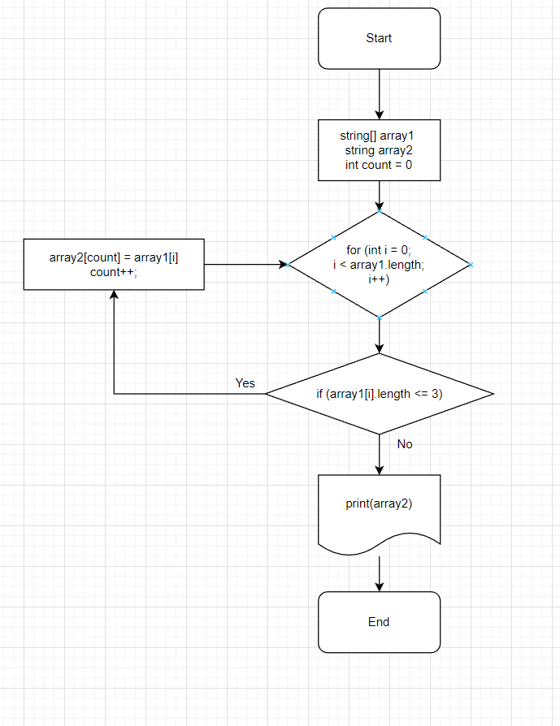

# Выбор специализации.
## Итоговая проверочная работа.
## Задача : 
> ### Написать программу, которая из имеющегося массива строк формирует массив из строк, длина которых меньше либо равна 3 символа. Первоначальный массив можно ввести с клавиатуры, либо задать на старте выполнения алгоритма. При решение не рекомендуется пользоваться коллекциями, лучше обойтись исключительно массивами.
## Описание алгоритма решения:
### Сначало объявляется два массива из строк: 
1. Изначальный заданный. 
2. Второй массив такой же длины как первый. 
### Далее создаем создаем метод.
В нем задается цикл проверки условия  проверки количества символов (<=3):
- если условие выполняется, то элемент первого массива заносится в count элемент второго массива. 
*После присвоения, переменная count увеличивается  на 1 и запускается следующая итерация цикла for в котором i увеличивается на 1. Проверка и присвоение элементов выполняется до момента выполнения условия (<=3).*

## Графическое представление метода расположено в папке Schem в двух файлах разных расширениях, а также представлена ниже:



## Решение задачи на языке C# расположено в папке Zadanie/Program.cs, а  также представлено ниже:
```
string[] array1 = new string[5] {"123", "23", "hello", "world", ":-)"};
string[] array2 = new string[array1.Length];

void SecondArrayWithIF(string[] array1, string[] array2)

{
    int count = 0;
    for (int i = 0; i < array1.Length; i++)
    {
    if(array1[i].Length <= 3)
        {
        array2[count] = array1[i];
        count++;
        }
    }
}
void PrintArray(string[] array)
{
    for (int i = 0; i < array.Length; i++)
    {
        Console.Write($"{array[i]} ");
    }
    Console.WriteLine();
}
SecondArrayWithIF(array1, array2);
PrintArray(array2);
```
## При выполнении задания учтены и выполнены следующие требования:
1. Создан репозиторий на GitHub.
2. Нарисована блок-схема алгоритма.
3. Репозиторий снабжен оформленным текстовым описанием решения.
4. Написана программа, решающая поставленную задачу.
5. Всё решение проекта выполнено с использованием контроля версий с применением разных коммитов при выполнении разных этапов решения.

